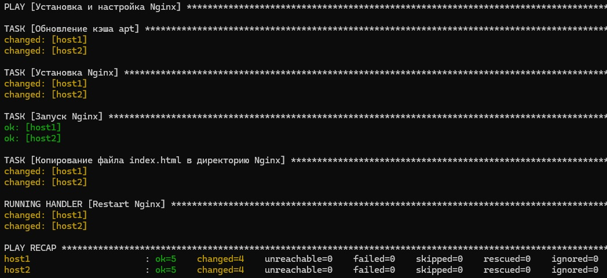

# Ansible playbook

## Установка Nginx с помощью Ansible
Этот Ansible плейбук предназначен для установки и настройки веб-сервера Nginx на хостах под управлением Ubuntu.

### Структура проекта
my_ansible_project/
├── README.md
├── files
│   └── index.html
├── group_vars
│   └── my_hosts.yml
├── hosts.ini
├── install_nginx.yml
└── ping_hosts.yml

### Использование
1. **Клонируйте репозиторий** или скопируйте файлы в вашу рабочую директорию.
2. **Настройте инвентарный файл** `hosts.ini`, добавив IP-адреса или имена хостов, на которых вы хотите установить Nginx.
3. **Запустите плейбук** с помощью следующей команды:
```bash
  ansible-playbook -i hosts.ini install_nginx.yml  
```
<p align="center">
  
</p>

Найдите IP-адрес из `hosts.ini`, и откройте его в браузере.
`<link>` : <http://192.168.1.77/>
<p align="center">
  
</p>

## SSH Key Copy Script
Этот скрипт на Bash `ssh-copy/copy_ssh_keys.sh` позволяет добавлять IP-адреса удаленных серверов в файл `known_hosts` и копировать публичный SSH-ключ с помощью `ssh-copy-id`.

Создайте файл со списком серверов `server_list.txt` и добавьте в него IP-адреса или имена хостов, по одному на строку:
```text
  192.168.1.100
  192.168.1.101...
```

### Запуск
```bash
  chmod +x copy_ssh_keys.sh
  ./copy_ssh_keys.sh
```
